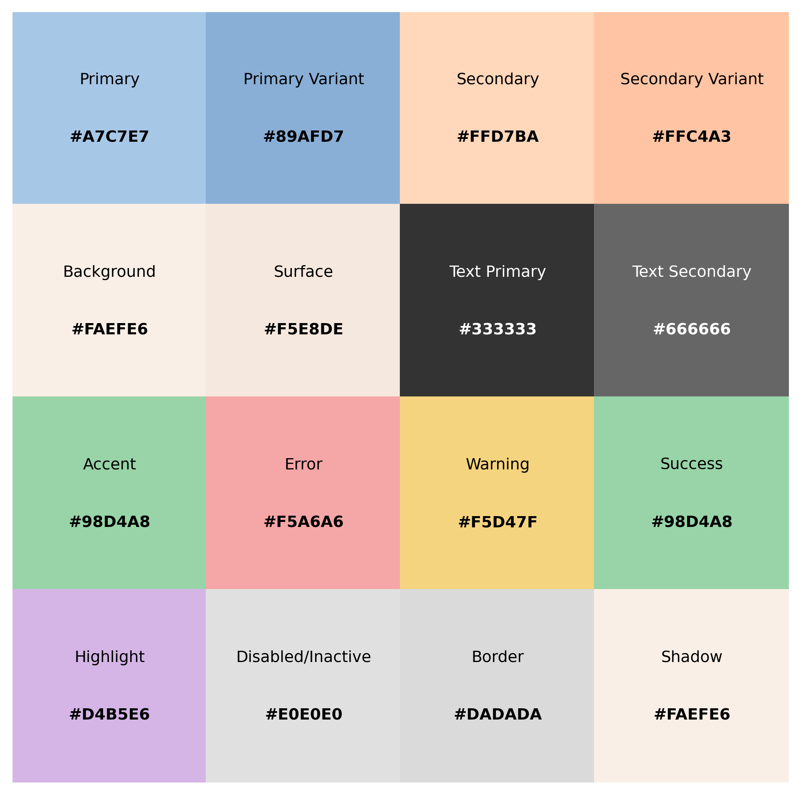

# Sakura

Sakura is a versatile pastel color scheme designed for multi-app systems. It emphasizes accessibility, consistency, and aesthetic appeal. This palette complies with WCAG (Web Content Accessibility Guidelines) standards, ensuring sufficient contrast and readability for users with varying visual abilities, while aligning with modern UI/UX design principles. This palette adheres to modern UI design principles, offering both light and dark themes to ensure usability across various environments and user preferences. This project includes tools and resources to help you integrate the Sakura palette into your applications or design workflows.

## Project Structure
```
D:\project\sakura
│
├── README.md                   # Description of the Sakura project
├── colors                      # Directory for color-related resources
│   ├── light-theme.md          # Details about the light theme
│   ├── dark-theme.md           # Details about the dark theme
│   ├── light_grid.png          # Visualization for the light theme
│   ├── dark_grid.png           # Visualization for the dark theme
│   └── generate_palette.py     # Python script to generate images
```

## Benefits

- **Accessibility**: High contrast between text and backgrounds ensures readability.
- **Adaptability**: Supports both light and dark themes for versatile use.
- **Aesthetic Appeal**: Soft pastel tones create a visually pleasing experience.
- **Consistency**: Encourages uniform design across multiple applications.

## Adherence to Standards

- Follows WCAG guidelines for text contrast and readability.
- Compatible with modern UI/UX principles for seamless integration.

## Color Themes

### Light Theme
- Soft pastel tones suitable for bright and airy designs.
- Designed for accessibility and readability with darker text.
- [Learn more about the Light Theme](./colors/light-theme.md).

### Dark Theme
- Muted pastel shades optimized for low-light environments.
- Provides excellent contrast with lighter text.
- [Learn more about the Dark Theme](./colors/dark-theme.md).

## Resources

### Visualizations
- **Light Grid**: 
  - A detailed visualization of the light theme.
- **Dark Grid**: 
  - A detailed visualization of the dark theme.

### Examples
- Use `generate_palette.py` to recreate the visualizations or customize the palette for your needs.

## Contributions

This project is currently not accepting contributions. However, feel free to fork the repository and adapt it for your needs.

## License

This project is licensed under the [MIT License](./LICENSE). See the LICENSE file for details.

---

Thank you for exploring Sakura! I hope this color scheme adds a touch of elegance to your projects.
